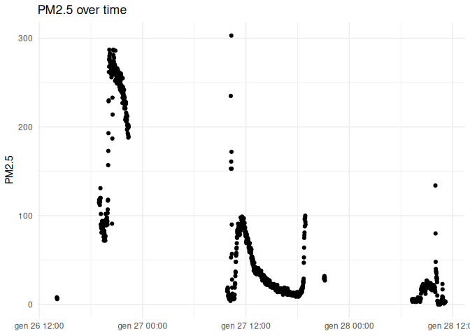

# pytrigger exploration


## Environment

The notebook uses `reticulate` to run Python and R in the same
document.  
This first check confirms which Python environment is active.

``` r
library(reticulate)

py_config()
```

    python:         /home/fuschetto/Desktop/trigger-analyses/.venv/bin/python
    libpython:      /home/fuschetto/.cache/R/reticulate/uv/python/cpython-3.12.13-linux-x86_64-gnu/lib/libpython3.12.so
    pythonhome:     /home/fuschetto/Desktop/trigger-analyses/.venv:/home/fuschetto/Desktop/trigger-analyses/.venv
    version:        3.12.13 (main, Jun 23 2026, 15:18:55) [Clang 22.1.3 ]
    numpy:          /home/fuschetto/Desktop/trigger-analyses/.venv/lib/python3.12/site-packages/numpy
    numpy_version:  2.5.1

    NOTE: Python version was forced by RETICULATE_PYTHON

## Setup

Load the required Python libraries and create dedicated folders for the
data and outputs produced by this notebook.

``` python
import ssl
import sys
from pathlib import Path

import pandas as pd
from trigger import TriggerDB

NOTEBOOK_ID = "00_pytrigger"

DATA_DIR = Path("data") / NOTEBOOK_ID
OUTPUT_DIR = Path("outputs") / NOTEBOOK_ID

DATA_DIR.mkdir(parents=True, exist_ok=True)
OUTPUT_DIR.mkdir(parents=True, exist_ok=True)

print(f"Python: {sys.executable}")
```

    Python: /home/fuschetto/Desktop/trigger-analyses/.venv/bin/python

``` python
print(f"OpenSSL: {ssl.OPENSSL_VERSION}")
```

    OpenSSL: OpenSSL 3.5.7 9 Jun 2026

``` python
print(f"Working directory: {Path.cwd()}")
```

    Working directory: /home/fuschetto/Desktop/trigger-analyses

``` python
print(f"Data directory: {DATA_DIR.resolve()}")
```

    Data directory: /home/fuschetto/Desktop/trigger-analyses/data/00_pytrigger

``` python
print(f"Output directory: {OUTPUT_DIR.resolve()}")
```

    Output directory: /home/fuschetto/Desktop/trigger-analyses/outputs/00_pytrigger

## Available tables

Connect to the TRIGGER API and list the tables currently available
through `pytrigger`.

``` python
with TriggerDB() as db:
    tables = db.tables()
```

    [INFO] Credentials loaded successfully
    [INFO] Logout success

``` python
print(f"Number of available tables: {len(tables)}")
```

    Number of available tables: 26

``` python
tables
```

    ['myair', 'ecg', 'ppg', 'gps', 'sleep', 'smartwatchlow', 'smartwatchhigh', 'myair_tidy', 'gps_tidy', 'sleep_tidy', 'smartwatchlow_tidy', 'smartwatchhigh_tidy', 'myair_5min', 'gps_5min', 'smartwatchlow_5min', 'smartwatchhigh_5min', 'myair_hourly', 'gps_hourly', 'smartwatchlow_hourly', 'smartwatchhigh_hourly', 'myair_daily', 'gps_daily', 'smartwatchlow_daily', 'smartwatchhigh_daily', 'active_accounts', 'accounts']

## Available columns

Inspect the columns exposed for a selected table before building a
query.

``` python
with TriggerDB() as db:
    myair_hourly_columns = db.columns("myair_hourly")
```

    [INFO] Credentials loaded successfully
    [INFO] Logout success

``` python
myair_hourly_columns
```

    ['userId', 'deviceId', 'firmware', 'bucket_hour', 'records_n', 'five_min_n', 'pm1_mean', 'pm1_min', 'pm1_max', 'pm1_raw_n', 'pm1_5min_n', 'pm25_mean', 'pm25_min', 'pm25_max', 'pm25_raw_n', 'pm25_5min_n', 'pm10_mean', 'pm10_min', 'pm10_max', 'pm10_raw_n', 'pm10_5min_n', 'pc03_mean', 'pc03_min', 'pc03_max', 'pc03_raw_n', 'pc03_5min_n', 'pc05_mean', 'pc05_min', 'pc05_max', 'pc05_raw_n', 'pc05_5min_n', 'pc1_mean', 'pc1_min', 'pc1_max', 'pc1_raw_n', 'pc1_5min_n', 'pc25_mean', 'pc25_min', 'pc25_max', 'pc25_raw_n', 'pc25_5min_n', 'pc5_mean', 'pc5_min', 'pc5_max', 'pc5_raw_n', 'pc5_5min_n', 'pc10_mean', 'pc10_min', 'pc10_max', 'pc10_raw_n', 'pc10_5min_n', 'temperature_mean', 'temperature_min', 'temperature_max', 'temperature_raw_n', 'temperature_5min_n', 'humidity_mean', 'humidity_min', 'humidity_max', 'humidity_raw_n', 'humidity_5min_n', 'pressure_mean', 'pressure_min', 'pressure_max', 'pressure_raw_n', 'pressure_5min_n', 'sound_mean', 'sound_min', 'sound_max', 'sound_raw_n', 'sound_5min_n', 'uvb_mean', 'uvb_min', 'uvb_max', 'uvb_raw_n', 'uvb_5min_n', 'light_mean', 'light_min', 'light_max', 'light_raw_n', 'light_5min_n']

## Select data

`select()` retrieves a filtered subset of a table.  
Here, the first 1,000 observations for user 187 are ordered by
timestamp.

``` python
with TriggerDB() as db:
    myair_tidy_get = pd.DataFrame(
        db.select(
            table="myair_tidy",
            columns=[
                "userId",
                "event_ts",
                "pm25",
                "temperature",
                "humidity",
            ],
            where={
                "userId": "=187",
            },
            order_by="event_ts",
            order="ASC",
            limit=1000,
        )
    )
```

    [INFO] Credentials loaded successfully

    Analyzing... |
    Analyzing... /
    Analyzing... -
                  
    [INFO] Logout success

``` python
myair_tidy_r = {
    column: myair_tidy_get[column].astype(object).tolist()
    for column in myair_tidy_get.columns
}

print(f"Shape: {myair_tidy_get.shape}")
```

    Shape: (1000, 5)

``` python
myair_tidy_get.head()
```

      userId             event_ts  pm25  temperature   humidity
    0    187  2026-01-26 14:02:34     8    26.360001  26.940001
    1    187  2026-01-26 14:03:34     7    26.500000  27.780001
    2    187  2026-01-26 14:04:34     6    26.680000  27.549999
    3    187  2026-01-26 14:05:34     7    26.980000  26.500000
    4    187  2026-01-26 18:56:02   115    22.530001  41.080002

## Plot data in R

The selected columns are converted to simple Python lists so that
`reticulate` can transfer them safely to R.

``` r
library(tidyverse)
```

    ── Attaching core tidyverse packages ──────────────────────── tidyverse 2.0.0 ──
    ✔ dplyr     1.2.1     ✔ readr     2.2.0
    ✔ forcats   1.0.1     ✔ stringr   1.6.0
    ✔ ggplot2   4.0.3     ✔ tibble    3.3.1
    ✔ lubridate 1.9.5     ✔ tidyr     1.3.2
    ✔ purrr     1.2.2     
    ── Conflicts ────────────────────────────────────────── tidyverse_conflicts() ──
    ✖ dplyr::filter() masks stats::filter()
    ✖ dplyr::lag()    masks stats::lag()
    ℹ Use the conflicted package (<http://conflicted.r-lib.org/>) to force all conflicts to become errors

``` r
py$myair_tidy_r %>%
  as_tibble() %>%
  mutate(
    userId = as.character(userId),
    event_ts = as.POSIXct(event_ts)
  ) %>%
  ggplot(aes(x = event_ts, y = pm25)) +
  geom_point() +
  labs(
    title = "PM2.5 over time",
    x = NULL,
    y = "PM2.5"
  ) +
  theme_minimal()
```



## Download complete table

`download()` retrieves the complete compressed dump and saves it in the
data folder associated with this notebook.

``` python
dump_file = DATA_DIR / "myair_tidy.csv.gz"

with TriggerDB() as db:
    myair_tidy_dump = db.download(
        table="myair_tidy",
        outfile=dump_file,
    )
```

    [INFO] Credentials loaded successfully

    Analyzing... |
                  
    [INFO] Logout success

``` python
print(f"Shape: {myair_tidy_dump.shape}")
```

    Shape: (0, 25)

``` python
print(f"File: {dump_file.resolve()}")
```

    File: /home/fuschetto/Desktop/trigger-analyses/data/00_pytrigger/myair_tidy.csv.gz

``` python
myair_tidy_dump.head()
```

    Empty DataFrame
    Columns: [userId, deviceId, firmware, event_ts, created_at, bucket_5min, date, hour, minute, second, pm1, pm25, pm10, pc03, pc05, pc1, pc25, pc5, pc10, temperature, humidity, pressure, sound, uvb, light]
    Index: []
