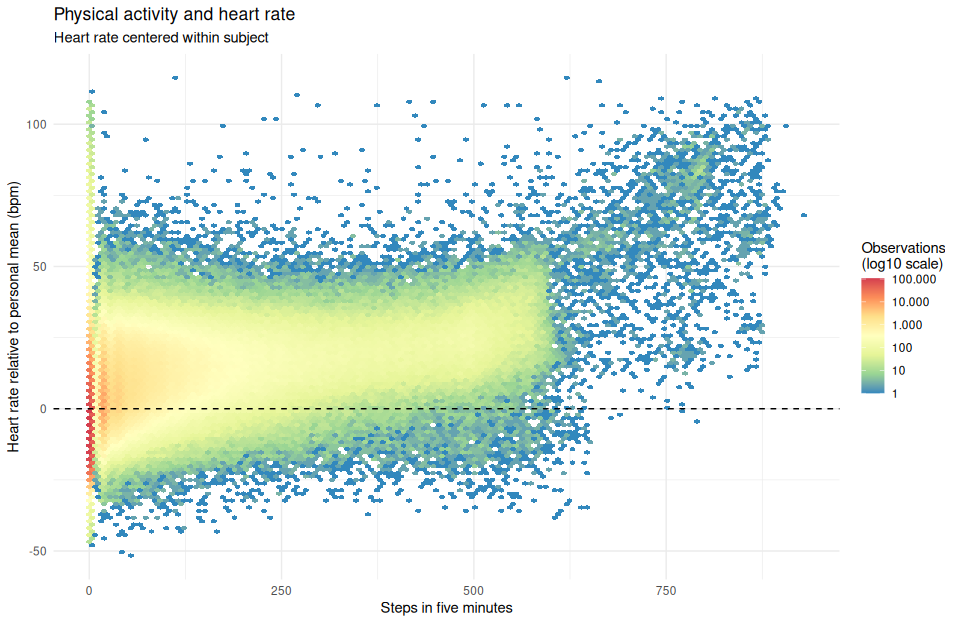
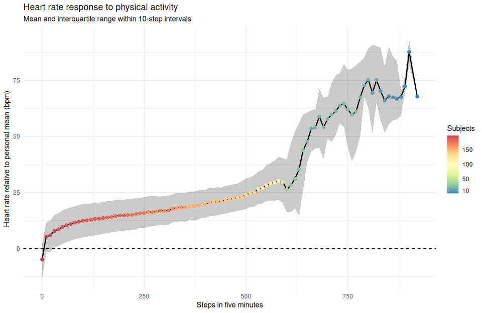
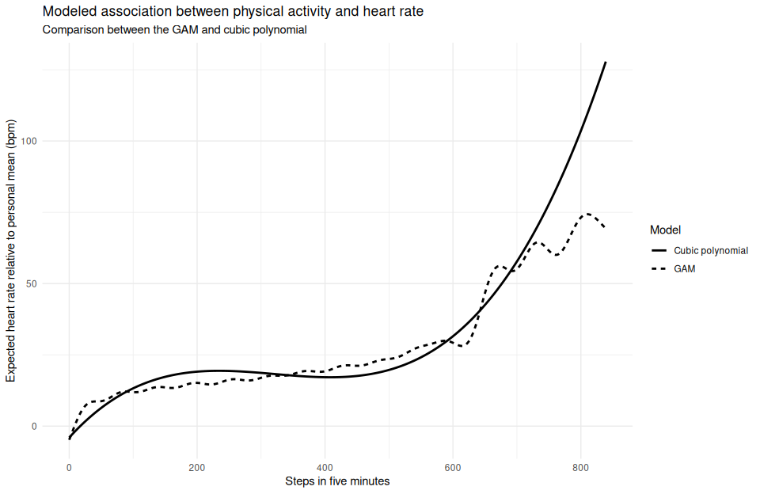
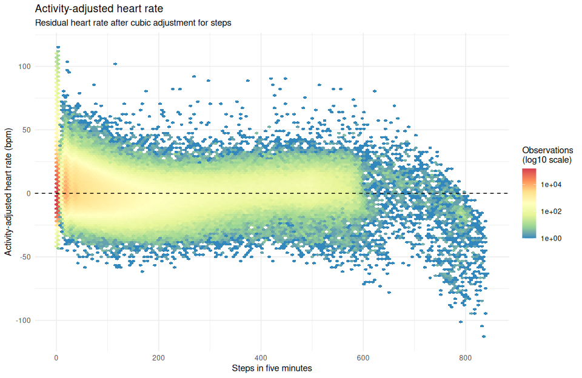
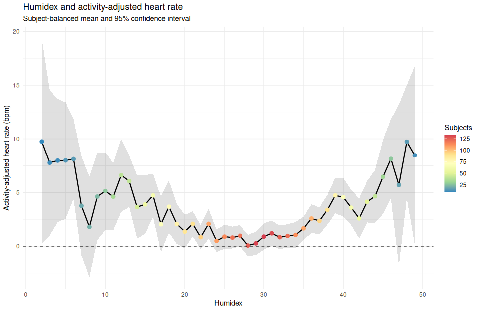

# Five-minute heart rate and thermal exposure
Alessandro Fuschi

## Setup

``` r
library(tidyverse)

cfg <- list(
  notebook_id = "5min_heart_rate_environment",
  data_dir = file.path("data", "5min"),
  output_dir = file.path("outputs", "5min_heart_rate_environment"),
  timezone = "UTC"
)

dir.create(cfg$output_dir, recursive = TRUE, showWarnings = FALSE)
```

## Data import

The five-minute tables are read using `userId` and `bucket_5min` as
analytical keys.

If an analytical key occurs more than once within the same table, all
corresponding rows are removed because the duplicate records cannot be
resolved unambiguously at this stage.

``` r
read_5min <- \(filename) {
  read_csv(
    file.path(cfg$data_dir, filename),
    na = c("", "NA", "NULL"),
    locale = locale(tz = cfg$timezone),
    col_types = cols(
      userId = col_character(),
      bucket_5min = col_datetime(format = "%Y-%m-%d %H:%M:%S")
    ),
    show_col_types = FALSE
  ) %>%
    add_count(userId, bucket_5min, name = "key_n") %>%
    filter(key_n == 1) %>%
    select(-key_n)
}
```

``` r
air <- read_5min("myair_5min.csv.gz")
swh <- read_5min("smartwatchhigh_5min.csv.gz")
swl <- read_5min("smartwatchlow_5min.csv.gz")

rm(read_5min)
```

## Heart-rate dataset

The analytical dataset is anchored to the heart-rate table. Activity and
environmental measurements are added when available for the same subject
and five-minute interval.

`step_mean` is used instead of `step_sum`, because the same step
measurement is repeated across the raw observations within each bucket.

``` r
hr_dat <- swh %>%
  transmute(
    userId,
    bucket_5min,
    heartrate = heartrate_mean,
    heartrate_min,
    heartrate_max
  ) %>%
  left_join(
    swl %>%
      transmute(
        userId,
        bucket_5min,
        steps = step_mean
      ),
    by = c("userId", "bucket_5min"),
    relationship = "one-to-one"
  ) %>%
  left_join(
    air %>%
      transmute(
        userId,
        bucket_5min,
        temperature = temperature_mean,
        humidity = humidity_mean
      ),
    by = c("userId", "bucket_5min"),
    relationship = "one-to-one"
  ) %>%
  arrange(userId, bucket_5min) %>%
  mutate(userId = factor(userId))
```

The original tables are no longer required.

``` r
rm(air, swh, swl)
```

## Derived variables

Humidex is calculated from temperature and relative humidity. Heart-rate
range represents the difference between the maximum and minimum heart
rate recorded within each five-minute interval.

``` r
hr_dat <- hr_dat %>%
  mutate(
    humidex = ThermIndex::humidex(
      temp = temperature,
      ur = humidity
    ),
    heartrate_range = heartrate_max - heartrate_min
  )
```

## Within-subject heart rate

Heart rate is centered around each subject’s personal mean.

This transformation removes between-subject differences in average heart
rate while preserving the original unit of measurement.

``` r
hr_dat <- hr_dat %>%
  group_by(userId) %>%
  mutate(
    heartrate_personal_mean = mean(heartrate, na.rm = TRUE),
    heartrate_c = heartrate - heartrate_personal_mean
  ) %>%
  ungroup()
```

Positive values of `heartrate_c` indicate a heart rate above the
subject’s personal mean. Negative values indicate a heart rate below the
personal mean.

## Data coverage

``` r
hr_dat %>%
  summarise(
    observations = n(),
    subjects = n_distinct(userId),
    heart_rate_observations = sum(!is.na(heartrate)),
    heart_rate_with_steps = sum(!is.na(heartrate) & !is.na(steps)),
    heart_rate_with_humidex = sum(!is.na(heartrate) & !is.na(humidex))
  ) %>%
  knitr::kable(
    format = "pipe",
    col.names = c(
      "Rows",
      "Subjects",
      "Heart rate",
      "Heart rate and steps",
      "Heart rate and Humidex"
    ),
    caption = "Heart-rate dataset coverage"
  )
```

|    Rows | Subjects | Heart rate | Heart rate and steps | Heart rate and Humidex |
|--------:|---------:|-----------:|---------------------:|-----------------------:|
| 3899098 |      201 |    2840826 |              2827951 |                 736296 |

Heart-rate dataset coverage

# Physical activity and heart rate

## Joint distribution

``` r
hr_dat %>%
  filter(!is.na(steps), !is.na(heartrate_c)) %>%
  ggplot(aes(x = steps, y = heartrate_c)) +
  geom_hex(bins = 120) +
  geom_hline(yintercept = 0, linetype = "dashed") +
  scale_fill_distiller(
    palette = "Spectral",
    direction = -1,
    transform = "log10",
    breaks = c(1, 10, 100, 1000, 10000, 100000),
    labels = scales::label_number(
      big.mark = ".",
      decimal.mark = ","
    ),
    name = "Observations\n(log10 scale)"
  ) +
  labs(
    title = "Physical activity and heart rate",
    subtitle = "Heart rate centered within subject",
    x = "Steps in five minutes",
    y = "Heart rate relative to personal mean (bpm)"
  ) +
  theme_minimal()
```



## Heart rate by step interval

Step counts are grouped into intervals of ten steps. For each interval,
the number of observations, number of subjects, mean centered heart rate
and interquartile range are calculated.

``` r
hr_steps_summary <- hr_dat %>%
  filter(!is.na(steps), !is.na(heartrate_c)) %>%
  mutate(steps_bin = floor(steps / 10) * 10) %>%
  group_by(steps_bin) %>%
  summarise(
    observations = n(),
    subjects = n_distinct(userId),
    mean_heartrate_c = mean(heartrate_c),
    q25 = quantile(heartrate_c, 0.25),
    q75 = quantile(heartrate_c, 0.75),
    .groups = "drop"
  )
```

``` r
hr_steps_summary %>%
  ggplot(aes(x = steps_bin, y = mean_heartrate_c)) +
  geom_ribbon(aes(ymin = q25, ymax = q75), alpha = 0.25) +
  geom_line(linewidth = 0.8) +
  geom_point(aes(color = subjects), size = 2) +
  geom_hline(yintercept = 0, linetype = "dashed") +
  scale_color_distiller(
    palette = "Spectral",
    direction = -1,
    name = "Subjects",
    breaks = c(10, 50, 100, 150)
  ) +
  labs(
    title = "Heart rate response to physical activity",
    subtitle = "Mean and interquartile range within 10-step intervals",
    x = "Steps in five minutes",
    y = "Heart rate relative to personal mean (bpm)"
  ) +
  theme_minimal()
```



## Support for high-activity intervals

``` r
hr_steps_summary %>%
  filter(steps_bin >= 500) %>%
  mutate(
    mean_heartrate_c = round(mean_heartrate_c, 1),
    q25 = round(q25, 1),
    q75 = round(q75, 1)
  ) %>%
  knitr::kable(
    format = "pipe",
    col.names = c(
      "Steps",
      "Observations",
      "Subjects",
      "Mean HR",
      "Q25",
      "Q75"
    ),
    caption = "Support for high-activity intervals"
  )
```

| Steps | Observations | Subjects | Mean HR |  Q25 |  Q75 |
|------:|-------------:|---------:|--------:|-----:|-----:|
|   500 |         2779 |      132 |    24.0 | 17.6 | 31.3 |
|   510 |         2345 |      137 |    24.8 | 18.7 | 31.7 |
|   520 |         2079 |      135 |    25.1 | 18.6 | 32.7 |
|   530 |         1941 |      126 |    26.5 | 19.7 | 34.3 |
|   540 |         1701 |      117 |    27.0 | 20.0 | 35.0 |
|   550 |         1608 |      116 |    28.2 | 21.1 | 37.3 |
|   560 |         1419 |      107 |    29.0 | 21.4 | 38.2 |
|   570 |         1297 |      103 |    29.5 | 21.3 | 39.2 |
|   580 |          890 |       88 |    30.2 | 21.7 | 40.8 |
|   590 |          483 |       62 |    29.7 | 20.3 | 40.4 |
|   600 |          206 |       36 |    26.3 | 16.1 | 39.8 |
|   610 |          147 |       29 |    28.2 | 16.3 | 47.0 |
|   620 |          117 |       25 |    31.1 | 18.0 | 52.2 |
|   630 |          104 |       25 |    35.2 | 14.7 | 55.9 |
|   640 |          107 |       27 |    43.9 | 26.0 | 59.8 |
|   650 |           83 |       20 |    47.6 | 38.5 | 60.6 |
|   660 |           80 |       16 |    53.5 | 43.1 | 61.7 |
|   670 |          107 |       20 |    54.0 | 44.7 | 61.9 |
|   680 |           67 |       20 |    58.8 | 44.8 | 71.2 |
|   690 |           79 |       22 |    54.1 | 39.9 | 67.2 |
|   700 |           70 |       23 |    57.7 | 48.9 | 67.8 |
|   710 |           72 |       24 |    59.8 | 47.6 | 73.8 |
|   720 |           76 |       19 |    61.2 | 50.7 | 77.2 |
|   730 |           81 |       20 |    63.8 | 55.8 | 78.2 |
|   740 |           88 |       22 |    64.6 | 54.1 | 82.3 |
|   750 |          107 |       23 |    61.9 | 44.9 | 79.7 |
|   760 |          112 |       24 |    59.7 | 38.9 | 80.3 |
|   770 |          129 |       26 |    61.1 | 43.4 | 81.7 |
|   780 |          145 |       20 |    67.4 | 50.0 | 83.3 |
|   790 |          157 |       17 |    72.7 | 67.6 | 85.2 |
|   800 |           75 |       19 |    75.3 | 62.7 | 89.3 |
|   810 |           61 |       13 |    69.3 | 51.2 | 90.8 |
|   820 |           46 |       12 |    75.2 | 65.1 | 90.3 |
|   830 |           38 |       11 |    70.3 | 57.1 | 89.6 |
|   840 |           66 |        9 |    66.0 | 51.5 | 81.0 |
|   850 |           74 |        9 |    67.9 | 55.3 | 90.0 |
|   860 |           59 |        7 |    67.4 | 57.1 | 85.7 |
|   870 |           61 |        6 |    66.7 | 57.6 | 83.7 |
|   880 |           13 |        3 |    67.7 | 59.2 | 70.6 |
|   890 |            9 |        3 |    72.4 | 69.8 | 76.6 |
|   900 |            2 |        1 |    87.7 | 81.9 | 93.4 |
|   920 |            1 |        1 |    67.8 | 67.8 | 67.8 |

Support for high-activity intervals

Intervals containing 840 or more steps are supported by fewer than ten
subjects and are excluded from the activity-adjustment model.

``` r
steps_cutoff <- 840

hr_steps_dat <- hr_dat %>%
  filter(
    !is.na(steps),
    !is.na(heartrate_c),
    steps < steps_cutoff
  ) %>%
  droplevels()
```

# Activity-adjusted heart rate

Two models are compared to describe the non-linear association between
physical activity and centered heart rate:

1.  a generalized additive model;
2.  a cubic polynomial model.

``` r
hr_steps_dat <- hr_steps_dat %>%
  mutate(steps_100 = steps / 100)

hr_steps_gam <- mgcv::bam(
  heartrate_c ~ s(steps, k = 30),
  data = hr_steps_dat,
  method = "fREML",
  discrete = TRUE
)

hr_steps_cubic <- lm(
  heartrate_c ~
    steps_100 +
    I(steps_100^2) +
    I(steps_100^3),
  data = hr_steps_dat
)
```

## Model comparison

``` r
gam_summary <- summary(hr_steps_gam)
cubic_summary <- summary(hr_steps_cubic)

hr_steps_model_comparison <- tibble(
  model = c(
    "GAM: s(steps, k = 30)",
    "Cubic polynomial"
  ),
  variance_explained = c(
    gam_summary$dev.expl,
    cubic_summary$adj.r.squared
  ),
  residual_sd = c(
    sqrt(gam_summary$scale),
    cubic_summary$sigma
  ),
  complexity = c(
    paste0(round(gam_summary$s.table[1, "edf"], 1), " EDF"),
    "3 polynomial terms"
  )
) %>%
  mutate(
    variance_explained = scales::percent(
      variance_explained,
      accuracy = 0.1
    ),
    residual_sd = round(residual_sd, 2)
  )

hr_steps_model_comparison %>%
  knitr::kable(
    format = "pipe",
    col.names = c(
      "Model",
      "Variance explained",
      "Residual SD",
      "Complexity"
    ),
    caption = "Physical-activity model comparison"
  )
```

| Model                 | Variance explained | Residual SD | Complexity         |
|:----------------------|:-------------------|------------:|:-------------------|
| GAM: s(steps, k = 30) | 31.8%              |       11.27 | 28.5 EDF           |
| Cubic polynomial      | 29.2%              |       11.49 | 3 polynomial terms |

Physical-activity model comparison

## Fitted relationships

``` r
steps_predictions <- tibble(
  steps = seq(
    min(hr_steps_dat$steps),
    max(hr_steps_dat$steps),
    length.out = 500
  )
) %>%
  mutate(steps_100 = steps / 100)

steps_predictions <- steps_predictions %>%
  mutate(
    gam = predict(
      hr_steps_gam,
      newdata = steps_predictions
    ),
    cubic = predict(
      hr_steps_cubic,
      newdata = steps_predictions
    )
  ) %>%
  pivot_longer(
    cols = c(gam, cubic),
    names_to = "model",
    values_to = "expected_heartrate"
  ) %>%
  mutate(
    model = recode(
      model,
      gam = "GAM",
      cubic = "Cubic polynomial"
    )
  )
```

``` r
steps_predictions %>%
  ggplot(
    aes(
      x = steps,
      y = expected_heartrate,
      linetype = model
    )
  ) +
  geom_line(linewidth = 1) +
  labs(
    title = "Modeled association between physical activity and heart rate",
    subtitle = "Comparison between the GAM and cubic polynomial",
    x = "Steps in five minutes",
    y = "Expected heart rate relative to personal mean (bpm)",
    linetype = "Model"
  ) +
  theme_minimal()
```



The GAM explained 31.8% of the variance in centered heart rate, compared
with 29.2% for the cubic model.

The residual standard deviations were 11.27 bpm for the GAM and 11.49
bpm for the cubic model.

The GAM provided only a modest improvement while requiring approximately
28.5 effective degrees of freedom. The cubic model uses only three
polynomial terms and captures most of the observed association. It was
therefore selected as the simpler activity-adjustment model.

## Activity-adjusted outcome

``` r
hr_steps_dat <- hr_steps_dat %>%
  mutate(
    heartrate_activity_expected = fitted(hr_steps_cubic),
    heartrate_activity_adj = residuals(hr_steps_cubic)
  )
```

`heartrate_activity_adj` is the observed centered heart rate minus the
value expected from the number of steps recorded during the same
five-minute interval.

Positive values indicate a heart rate higher than expected for the
recorded level of activity.

## Residual association with physical activity

``` r
hr_steps_dat %>%
  ggplot(aes(x = steps, y = heartrate_activity_adj)) +
  geom_hex(bins = 120) +
  geom_hline(yintercept = 0, linetype = "dashed") +
  scale_fill_distiller(
    palette = "Spectral",
    direction = -1,
    transform = "log10",
    name = "Observations\n(log10 scale)"
  ) +
  labs(
    title = "Activity-adjusted heart rate",
    subtitle = "Residual heart rate after cubic adjustment for steps",
    x = "Steps in five minutes",
    y = "Activity-adjusted heart rate (bpm)"
  ) +
  theme_minimal()
```



# Thermal exposure and activity-adjusted heart rate

## Humidex

The association between thermal conditions and activity-adjusted heart
rate is explored using one-unit Humidex intervals.

To prevent subjects with more observations from dominating the summary,
a mean value is first calculated for each subject within each Humidex
interval. These subject-specific means are then averaged across
subjects.

``` r
hr_humidex_summary <- hr_steps_dat %>%
  filter(
    !is.na(humidex),
    !is.na(heartrate_activity_adj)
  ) %>%
  mutate(humidex_bin = floor(humidex)) %>%
  group_by(userId, humidex_bin) %>%
  summarise(
    user_mean = mean(heartrate_activity_adj),
    observations = n(),
    .groups = "drop"
  ) %>%
  group_by(humidex_bin) %>%
  summarise(
    observations = sum(observations),
    subjects = n(),
    mean_heartrate_adj = mean(user_mean),
    sd_between_subjects = sd(user_mean),
    .groups = "drop"
  ) %>%
  filter(subjects >= 10) %>%
  mutate(
    se = sd_between_subjects / sqrt(subjects),
    ci_low =
      mean_heartrate_adj -
      qt(0.975, df = subjects - 1) * se,
    ci_high =
      mean_heartrate_adj +
      qt(0.975, df = subjects - 1) * se
  )
```

``` r
hr_humidex_summary %>%
  ggplot(aes(x = humidex_bin, y = mean_heartrate_adj)) +
  geom_ribbon(
    aes(ymin = ci_low, ymax = ci_high),
    alpha = 0.15
  ) +
  geom_line(linewidth = 0.8) +
  geom_point(aes(color = subjects), size = 2.5) +
  geom_hline(yintercept = 0, linetype = "dashed") +
  scale_color_distiller(
    palette = "Spectral",
    direction = -1,
    name = "Subjects"
  ) +
  labs(
    title = "Humidex and activity-adjusted heart rate",
    subtitle = "Subject-balanced mean and 95% confidence interval",
    x = "Humidex",
    y = "Activity-adjusted heart rate (bpm)"
  ) +
  theme_minimal()
```



This analysis is exploratory. The activity-adjusted outcome is useful
for visualizing the association, while formal inference should model
physical activity and thermal exposure jointly and account for repeated
measurements within subjects.
